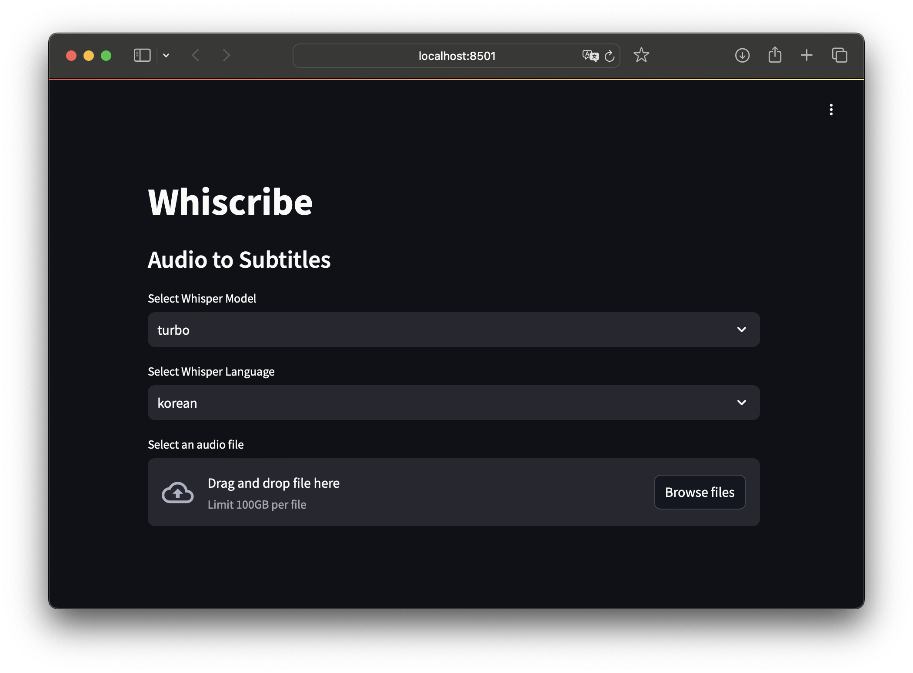

# Whiscribe

[](https://hits.sh/github.com/silentsoft/whiscribe/)

**Whiscribe** is a tool with a UI that transcribes audio files into subtitles in SRT format using OpenAI's Whisper.
The entire process, including audio processing and transcription, runs completely on your local machine, ensuring privacy and security for your audio data.



## Features

- **Audio Transcription**: Convert audio files (MP3, WAV, MP4) to text using the Whisper model.
- **Audio Track Extraction**: Extract and convert audio tracks from MP4 files using FFmpeg.
- **Subtitle Export**: Generate subtitles in SRT format and download them directly.
- Simple user interface built with Streamlit

## Prerequisites

1. Install Rust
   ```shell
   $ curl --proto '=https' --tlsv1.2 -sSf https://sh.rustup.rs | sh
   ```

2. Install `ffmpeg`:
   - **macOS**: `brew install ffmpeg`
   - **Windows**: Install from [FFmpeg download page](https://ffmpeg.org/download.html)

3. Install `Poetry`
   ```shell
   $ curl -sSL https://install.python-poetry.org | python3 -
   ```

## Installation

1. Clone the repository:
   ```shell
   $ git clone https://github.com/silentsoft/whiscribe.git
   $ cd whiscribe
   ```

2. Install Dependencies:
   ```shell
   $ poetry install
   ```

## Usage

1. Run the app:
   ```shell
   $ whiscribe
   ```

2. Open your browser:
    - The app will run at http://localhost:8501. Select an audio file and generate subtitles!

## Contributing
Pull requests are welcome. For major changes, please open an issue first to discuss what you would like to change.

Please note we have a [CODE_OF_CONDUCT](https://github.com/silentsoft/whiscribe/blob/main/CODE_OF_CONDUCT.md), please follow it in all your interactions with the project.

## License
This project is licensed under the MIT License. See the [LICENSE](https://github.com/silentsoft/whiscribe/blob/main/LICENSE.txt) file for details.
