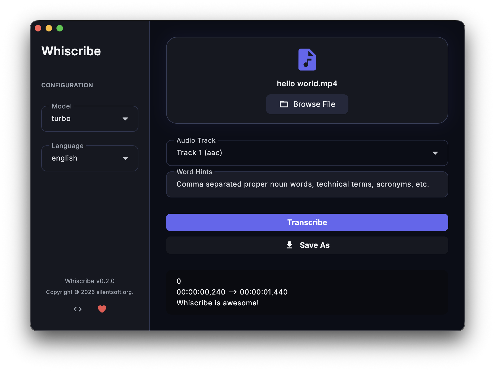

<h1 align="center">
  <br/>
  <a href="https://hits.sh/github.com/silentsoft/whiscribe/"></a><br/>
  Whiscribe
</h1>
<h4 align="center">
  <b>Whiscribe</b> is a tool with a UI that transcribes audio files into subtitles in SRT format using OpenAI's Whisper.
The entire process, including audio processing and transcription, runs completely on your local machine, ensuring privacy and security for your audio data.
</h4>



## Features

- **Audio Transcription**: Convert audio files to text using the Whisper model.
- **Word Hint Support**: Improve subtitle accuracy with custom word hints for domain-specific terms or uncommon vocabulary.
- **Subtitle Export**: Generate and save as subtitles in SRT format.

## Prerequisites

1. Install Git LFS
   ```shell
   $ brew install git-lfs
   ```

2. Install `Poetry`
   ```shell
   $ curl -sSL https://install.python-poetry.org | python3 -
   ```

## Installation

1. Clone the repository:
   ```shell
   $ git clone https://github.com/silentsoft/whiscribe.git
   $ cd whiscribe
   ```

2. Install Dependencies:
   ```shell
   $ poetry install
   ```

## Usage

1. Activate the `Poetry` virtual environment:
   - `Poetry` version < 2.0.0
     ```shell
     $ poetry shell
     ```
   - `Poetry` version >= 2.0.0
     ```shell
     $ poetry env activate
     ```

2. Run the app:
   ```shell
   $ poetry run whiscribe
   ```

## Contributing
Pull requests are welcome. For major changes, please open an issue first to discuss what you would like to change.

Please note we have a [CODE_OF_CONDUCT](https://github.com/silentsoft/whiscribe/blob/main/CODE_OF_CONDUCT.md), please follow it in all your interactions with the project.

## License
This project is licensed under the MIT License. See the [LICENSE](https://github.com/silentsoft/whiscribe/blob/main/LICENSE.txt) file for details.
